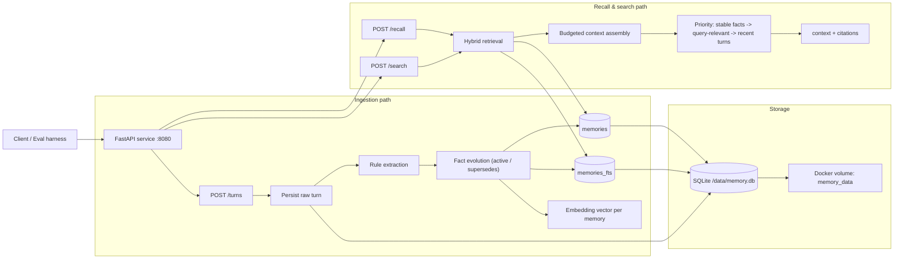

# Memory service

A single-container **FastAPI** service that ingests chat turns, extracts **structured memories** with deterministic rules, persists them in **SQLite + FTS5**, and serves **hybrid recall** (full-text + embeddings + lexical overlap) with **mutable-fact supersession** (employment moves, opinion shifts, and similar updates keep history without polluting the active view).

**Default URL:** [http://localhost:8080](http://localhost:8080)

---

## Contents

- [Quick start](#quick-start)
- [Rebuild after code changes](#rebuild-after-code-changes)
- [HTTP API](#http-api)
- [Configuration](#configuration)
- [Architecture](#architecture)
- [Backing Store Choice](#backing-store-choice)
- [Behavior](#behavior)
- [Tradeoffs](#tradeoffs)
- [Failure modes](#failure-modes)
- [Running tests & fixtures](#running-tests--fixtures)
- [Embeddings](#embeddings)

---

## Quick start

From the repository root (where `docker-compose.yml` lives):

```bash
docker compose up -d --build
until curl -sf http://localhost:8080/health; do sleep 1; done
```

On a clean machine with no existing image, plain `docker compose up -d` also works (Compose builds once because `build: .` is configured). Use `--build` after local code edits.

**Optional:** when you are editing Python under `src/` frequently, use live rebuilds:

```bash
docker compose watch
```

Cold clone (evaluator-style) in one block:

```bash
git clone <your-repo-url> memory-service
cd memory-service
docker compose up -d --build
until curl -sf http://localhost:8080/health; do sleep 1; done
```

There is **no supported `pip install` on the host** for this workflow: dependencies install during **`docker build`**; tests and helper scripts are meant to run **`docker compose exec memory-service …`** (see [Running tests & fixtures](#running-tests--fixtures)).

---

## Rebuild after code changes

Application code is **`COPY`'d** into the image. Only the **`memory_data`** volume (SQLite under `/data`) is mounted from outside. So:

- **`docker compose up -d`** starts whatever image you **already** built. After you change `src/`, that image is stale until you rebuild.
- **`docker compose up -d --build`** rebuilds layers that changed, then starts containers. You normally do **not** need `--no-cache`; reserve that for debugging the build cache itself.

---

## HTTP API

| Method | Path | Purpose |
| ------ | ---- | ------- |
| `GET` | `/health` | Liveness; `503` if the store is unavailable |
| `POST` | `/turns` | Ingest a turn; extract memories; return `201` with turn id |
| `POST` | `/recall` | Query-budgeted context string + citations |
| `POST` | `/search` | Hybrid search over stored memories |
| `GET` | `/users/{user_id}/memories` | List memories for a user (includes inactive / superseded rows) |
| `DELETE` | `/sessions/{session_id}` | Remove session-scoped data |
| `DELETE` | `/users/{user_id}` | Remove user-scoped data |

Malformed JSON returns **400**; validation issues return **422**; oversized bodies return **413**. When `MEMORY_AUTH_TOKEN` is set, other routes expect `Authorization: Bearer <token>`.

---

## Configuration

| Variable | Default | Role |
| -------- | ------- | ---- |
| `MEMORY_DB_PATH` | `/data/memory.db` | SQLite file path (persisted via Compose volume) |
| `MEMORY_AUTH_TOKEN` | _(empty)_ | If set, enables bearer auth on non-health routes |
| `MAX_PAYLOAD_BYTES` | `1048576` | Reject request bodies larger than this |
| `OPENAI_API_KEY` | _(empty)_ | If set, use OpenAI embeddings; else hash fallback |
| `OPENAI_EMBEDDING_MODEL` | `text-embedding-3-small` | Embedding model when API key present |
| `EMBEDDING_DIM` | `128` | Dimension for hash-based embedding vectors |

---

## Architecture

Ingestion is **synchronous**: the service does not return **`201`** from `/turns` until the turn is stored, memories extracted, mutable keys reconciled, embeddings computed, and FTS rows updated. That makes **`GET /users/.../memories`** and **`POST /recall`** immediately consistent with the last accepted turn.



Persistent state lives in a **named volume** (`memory_data` → `/data`), so `docker compose down` does not erase the database unless you remove the volume deliberately.

---

## Backing Store Choice

This service uses **SQLite + FTS5** and stores one embedding vector per memory row.

Why this choice:
- **Single-container deployability:** no external DB service needed for evaluator setup.
- **Strong sync semantics:** local ACID transactions align well with “`/turns` returns only after data is queryable.”
- **Good retrieval primitives:** FTS5 handles exact-token relevance; vectors and lexical overlap improve semantic/generalization behavior.
- **Operational simplicity:** persistence is a named Docker volume, easy to inspect and reset.

---

## Behavior

**Extraction** (user messages only, rule/regex): employment and moves, pets (explicit and lightly implicit phrasing), allergies, diet/style preferences, relationships, topic-scoped opinions, and short correction-shaped utterances. See [CHANGELOG.md](CHANGELOG.md) for design tradeoffs (especially implicit pets and noise rejection).

**Recall** blends **BM25-style FTS**, **cosine similarity on stored vectors**, and **token overlap**, then assembles **budgeted** prose: stable profile facts, query-relevant hits, and a small slice of recent turns. If nothing relevant clears the internal gate, **`context` is empty** (HTTP 200)—by design for unrelated queries.

**Mutable facts** (jobs, location, pet, many opinions, etc.) use **supersession**: a new conflicting value **deactivates** the previous row and stores a pointer via **`supersedes`**, so histories stay inspectable while recall prefers active rows.

**Session scoping:** the same **`user_id`** may see memories across **`session_id`** values; when **`user_id`** is omitted from a recall payload, behavior follows the contract for session-only recall.

---

## Tradeoffs

- **Optimized for evaluator correctness over maximal model sophistication:** deterministic extraction is debuggable and stable, but misses nuanced paraphrases that an LLM extractor could capture.
- **SQLite simplicity vs scale ceiling:** excellent local reliability, but not an ANN-scale architecture for very large corpora.
- **Synchronous `/turns` correctness vs write latency:** immediate read-after-write is guaranteed, with higher per-turn latency than async pipelines.
- **Hybrid recall tuned for precision + signal coverage:** FTS/cosine/lexical fusion improves quality, but adds more ranking knobs to calibrate.

---

## Failure modes

- **Cold session / no relevant memory:** `/recall` returns `{"context": "", "citations": []}` with HTTP 200.
- **Malformed JSON / schema errors:** 400 for malformed JSON, 422 for validation errors.
- **Oversized payload:** request rejected with 413 (`MAX_PAYLOAD_BYTES`).
- **Missing embedding API key:** service falls back to deterministic local embeddings and remains functional.
- **Store problems (e.g. DB corruption/unavailable):** `/health` reports non-ready via 503 path.

---

## Running tests & fixtures

**Pytest (canonical, in container):**

```bash
docker compose up -d --build
until curl -sf http://localhost:8080/health; do sleep 1; done
docker compose exec memory-service python -m pytest -q tests/
```

**Full smoke (build, health, HTTP samples, pytest):**

```bash
chmod +x scripts/verify.sh
./scripts/verify.sh
```

**Recall fixtures** (stdlib HTTP client; run inside the container so `/app` paths resolve):

```bash
docker compose exec memory-service \
  python3 /app/scripts/run_recall_fixture.py \
  --base http://127.0.0.1:8080 \
  --fixture fixtures/recall_fixture.json
```

Multi-hop script (stricter internal threshold):

```bash
docker compose exec memory-service \
  python3 /app/scripts/run_recall_fixture.py \
  --base http://127.0.0.1:8080 \
  --fixture fixtures/multi_hop_fixture.json \
  --min-score 0.66
```

With optional auth:

```bash
docker compose exec memory-service \
  python3 /app/scripts/run_recall_fixture.py \
  --base http://127.0.0.1:8080 \
  --token "${MEMORY_AUTH_TOKEN}"
```

| Fixture | Role |
| ------- | ---- |
| `fixtures/recall_fixture.json` | Primary scripted conversation and recall probes |
| `fixtures/multi_hop_fixture.json` | Relocation + implicit pet resurfacing in recall |
| `fixtures/cleanup_search_fixture.json` | `/search` plus session delete (used by pytest) |

`tests/test_fixtures_extended.py` loads these JSON files end-to-end; **`run_recall_fixture.py`** accepts **`--fixture PATH`** for ad-hoc runs.

---

## Embeddings

By default the service uses **deterministic hash embeddings** (no network, no API key). If **`OPENAI_API_KEY`** is set, it optionally calls the OpenAI embeddings API and **still** fuses with FTS and lexical signals—retrieval never degrades to embedding-only **`top-k`** ranking.

---

## Design history

For substantive iterations (what was tried, what failed in practice, what changed), see **[CHANGELOG.md](CHANGELOG.md)**.
