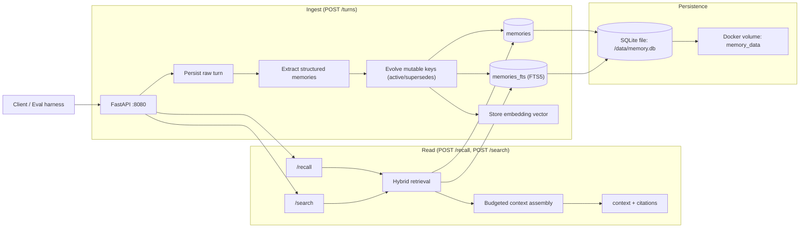

# Memory service

Single-container memory service (FastAPI) that ingests completed turns, extracts **structured memories** (facts/preferences/opinions/events), persists them in **SQLite + FTS5**, and serves **hybrid recall** with **fact evolution** (supersession) and explicit **token-budgeted** context assembly.

Base URL: `http://localhost:8080`

---

## Architecture

`POST /turns` is synchronous: it persists the turn, runs extraction, applies fact evolution, updates FTS/embeddings, and only then returns `201`. After that, `/recall` and `/users/{user_id}/memories` reflect the turn immediately.



---

## Backing store

**SQLite + FTS5**, persisted on a named Docker volume. WAL mode is enabled to improve read/write concurrency.

Rationale:
- single container, no external dependencies
- ACID semantics align with strict read-after-write requirements
- FTS5 provides a strong keyword signal for “name/where/work” queries
- easy inspection via `/users/{user_id}/memories`

---

## API surface

Contract endpoints:
- `GET /health`
- `POST /turns`
- `POST /recall`
- `POST /search`
- `GET /users/{user_id}/memories`
- `DELETE /sessions/{session_id}`
- `DELETE /users/{user_id}`

Optional auth: set `MEMORY_AUTH_TOKEN` and send `Authorization: Bearer <token>` (health remains unauthenticated).

---

## Extraction pipeline

This service stores raw turns, but recall operates on **extracted structured memories**. Current extractor is deterministic (rules/regex) and produces typed rows with keys and confidence scores:

- **facts**: employment, location (+ relocation event), pets (explicit and lightly implicit phrasing), allergies, relationships/family
- **preferences**: diet, response style (`I prefer ...`)
- **opinions**: topic-scoped stances (supports opinion evolution)
- **events**: correction-shaped utterances (normalized to avoid raw sentence blobs where possible)

The reviewer-visible artifact is `/users/{user_id}/memories`: it returns the structured memory table with provenance (`source_session`, `source_turn`) and evolution fields (`active`, `supersedes`).

---

## Recall strategy

`POST /recall` does:

1. **Hybrid retrieval** over active memories (FTS5 + cosine similarity + lexical overlap).
2. **Relevance gating**: if no stable/profile or query-relevant memories pass the gate, return `{"context":"","citations":[]}`.
3. **Budgeted assembly** under `max_tokens` (approximate):
   - stable user facts/preferences first,
   - then query-relevant memories + citations,
   - then a small slice of recent turns for grounding.

This is intentionally not “vanilla cosine top‑k”: keyword and lexical signals remain first-class.

---

## Fact evolution

Certain memory keys are treated as mutable (employment/location/pets/preferences/opinions). On contradiction:
- previous active row is deactivated
- new row becomes active
- new row references prior row via `supersedes`

This keeps recall aligned to current truth while preserving history for inspection.

---

## Operational notes

Persistence is via a named volume (`memory_data`) mounted at `/data`; data survives `docker compose down` unless the volume is removed explicitly.

Source code is baked into the image (`COPY src`). On a clean clone, `docker compose up -d` builds automatically. After local edits, run:

```bash
docker compose up -d --build
```

---

## Configuration

See `.env.example` for all optional knobs. Common ones:
- `MEMORY_AUTH_TOKEN` (optional auth)
- `MAX_PAYLOAD_BYTES` (request limit; returns 413 if exceeded)
- `OPENAI_API_KEY` / `OPENAI_EMBEDDING_MODEL` (optional better embeddings)

---

## Tests and self-eval fixtures

Run tests in the container (no host `pip install` required):

```bash
docker compose up -d --build
until curl -sf http://localhost:8080/health; do sleep 1; done
docker compose exec memory-service python -m pytest -q tests/
```

Fixtures (end-to-end ingestion + recall scoring):

```bash
docker compose exec memory-service python3 /app/scripts/run_recall_fixture.py --base http://127.0.0.1:8080 --fixture fixtures/recall_fixture.json
docker compose exec memory-service python3 /app/scripts/run_recall_fixture.py --base http://127.0.0.1:8080 --fixture fixtures/multi_hop_fixture.json --min-score 0.66
```

Smoke path (build + probe + pytest):

```bash
chmod +x scripts/verify.sh
./scripts/verify.sh
```

---

## Tradeoffs and failure modes

- Deterministic extraction is debuggable and stable, but misses nuanced paraphrases an LLM extractor could catch.
- When no memory is relevant, `/recall` returns empty context (HTTP 200) by design.
- If `OPENAI_API_KEY` is not set, embeddings fall back to deterministic local hashing; the service remains functional.
